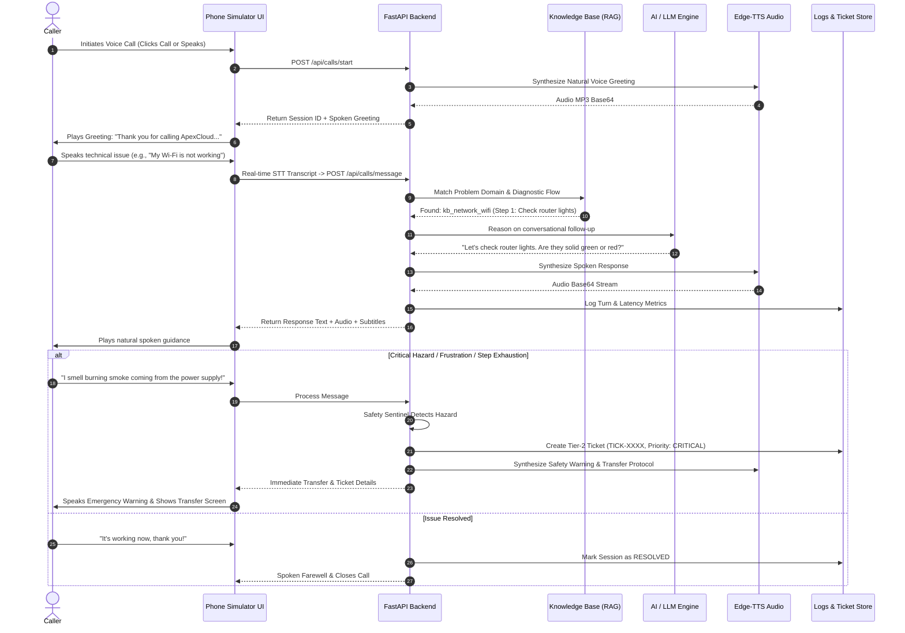

# 🎧 ApexCloud AI Voice Technical Support Agent

> **An end-to-end, multi-turn AI Voice Agent prototype designed to answer technical support calls, transcribe speech in real time, diagnose complex IT problems using structured decision trees, speak natural audio responses, escalate critical issues to human specialists, and maintain complete call analytics.**

---

## 🌟 Key System Capabilities

- **🎙️ Real-Time Voice Interaction:** Full conversational voice loop integrating Speech-to-Text (STT), AI reasoning, and Text-to-Speech (TTS).
- **🧠 Hybrid AI Reasoning Engine:**
  - **Built-in Offline Diagnostic Engine:** Deterministic, stateful decision tree engine that runs **100% locally with zero external API dependencies**.
  - **Multi-Provider LLM Integration:** Seamless runtime switching between **Google Gemini 2.0 Flash**, **OpenAI GPT-4o-mini**, and **Groq Llama 3.3 70B**.
- **🌲 Multi-Turn Diagnostic Decision Trees:** Step-by-step troubleshooting that guides callers, verifies each step's outcome, and asks targeted follow-ups.
- **🚨 Intelligent Human Support Escalation:** Automatic Tier-2 ticket creation with priority calculation (`CRITICAL`, `HIGH`, `MEDIUM`) for unresolved problems, user frustration, or hardware fire/smoke hazards.
- **📊 Real-Time Call History & Analytics Dashboard:** Turn-by-turn transcript logs, sentiment classification, latency breakdown (STT, LLM, TTS), and one-click **CSV/JSON export**.
- **📱 Modern Softphone Simulator:** Sleek dark-mode interface featuring animated canvas audio waveforms, caller ID, timer, mute/hold/escalate controls, live subtitles HUD, and **6 pre-loaded test scenarios**.

---

## 🔄 End-to-End Conversation Flow



---

## 📋 Predefined Technical Support Scenarios

The agent comes pre-loaded with comprehensive technical support knowledge bases and diagnostic step trees:

1. **🌐 Wi-Fi & Internet Connectivity (`kb_network_wifi`):**
   - Symptom: Wi-Fi connected with no internet, DNS failure.
   - Diagnostic Flow: Router light verification $\rightarrow$ 30-second power cycle $\rightarrow$ OS DNS cache flush (`ipconfig /flushdns`) $\rightarrow$ Verified resolution.
2. **🔑 Account Access & Password Reset (`kb_account_password`):**
   - Symptom: Account lockout after failed logins, 2FA code missing.
   - Diagnostic Flow: Portal vs Domain check $\rightarrow$ SMS/Email secure reset link dispatch $\rightarrow$ Password policy validation.
3. **🖨️ Printer & Peripheral Troubleshooting (`kb_hardware_printer`):**
   - Symptom: Printer offline, paper jam error, stuck print queue.
   - Diagnostic Flow: Hardware status check $\rightarrow$ Windows Print Spooler restart (`services.msc`) $\rightarrow$ Test page print verification.
4. **💻 OS Performance & Blue Screen (`kb_os_bsod_performance`):**
   - Symptom: 100% CPU/RAM freeze, Blue Screen of Death (BSOD).
   - Diagnostic Flow: Task Manager triage $\rightarrow$ System File Checker scan (`sfc /scannow`) $\rightarrow$ Safe mode recovery.
5. **⚙️ Software Installation & Error 0x80070005 (`kb_software_install`):**
   - Symptom: Setup crash, Access Denied error.
   - Diagnostic Flow: Run as administrator elevation $\rightarrow$ Temporary `%temp%` cache purge $\rightarrow$ Installation confirmation.
6. **🔥 Critical Safety Hazard & Supervisor Escalation (`kb_critical_escalation`):**
   - Symptom: Smoke, burning odor, electrical sparks, liquid spill, or explicit customer demand for a human supervisor.
   - Flow: Immediate emergency safety instructions (unplug device) $\rightarrow$ Automatic `CRITICAL` Tier-2 Ticket creation $\rightarrow$ Simulated transfer to human specialist.

---

## 📁 Project Directory Structure

```
ai-voice-technical-support/
├── backend/
│   ├── app/
│   │   ├── config.py                 # App settings, paths, API credentials
│   │   ├── main.py                   # FastAPI app, CORS, static mounting
│   │   ├── models/                   # Pydantic v2 data models
│   │   │   ├── call_session.py       # CallSession, Turn, Status enums
│   │   │   ├── knowledge.py          # KnowledgeArticle, TroubleshootingStep
│   │   │   └── ticket.py             # EscalationTicket, TicketPriority
│   │   ├── services/                 # Core business & AI logic
│   │   │   ├── rag_service.py        # Knowledge base & decision tree search
│   │   │   ├── llm_service.py        # Gemini, OpenAI, Groq & Offline engine
│   │   │   ├── escalation_service.py # Hazard sentinels & ticket generator
│   │   │   ├── session_service.py    # CDR logger & analytics aggregator
│   │   │   ├── stt_service.py        # Speech-to-Text ingestion service
│   │   │   └── tts_service.py        # Edge-TTS neural speech synthesizer
│   │   ├── routes/                   # FastAPI REST & WebSocket routers
│   │   │   ├── call_routes.py        # Call lifecycle & WebSocket streams
│   │   │   ├── knowledge_routes.py   # KB & FAQ queries
│   │   │   ├── logs_routes.py        # Call history & CSV export
│   │   │   └── ticket_routes.py      # Support tickets
│   │   └── data/
│   │       ├── knowledge_base.json   # 6 domain troubleshooting trees & FAQs
│   │       ├── call_logs/            # Persisted JSON call session records
│   │       └── tickets/              # Persisted JSON escalation tickets
├── frontend/
│   ├── index.html                    # Glassmorphism Phone Simulator UI
│   ├── css/
│   │   └── style.css                 # Responsive stylesheet & animations
│   └── js/
│       ├── app.js                    # UI orchestration & tab routing
│       ├── phone_call.js             # Voice call state machine, STT, Web Audio
│       ├── audio_visualizer.js       # Real-time sine wave canvas visualizer
│       ├── dashboard.js              # Call records, transcripts & analytics
│       └── kb_explorer.js            # Knowledge base search UI
├── tests/
│   ├── test_api_endpoints.py         # REST endpoint integration tests
│   ├── test_rag_service.py           # Knowledge base search & step evaluation
│   ├── test_escalation.py            # Safety hazards & ticket creation
│   ├── test_llm_service.py           # Multi-provider reasoning tests
│   └── test_scenarios.py             # 5 End-to-End conversational flows
├── docs/
│   ├── ARCHITECTURE.md               # Technical specification & sequence diagrams
│   ├── KNOWLEDGE_BASE.md             # Decision trees, FAQ dataset & error codes
│   ├── TESTING_REPORT.md             # Test matrix, results & latency benchmarks
│   └── DESIGN_DECISIONS.md           # Architecture trade-offs & design reasoning
├── run.py                            # Single-command launcher script
├── pytest.ini                        # Pytest configuration
├── requirements.txt                  # Python dependencies
└── README.md                         # Master documentation
```

---

## 🚀 Quick Start Guide

### 1. Prerequisites
- **Python 3.10+** (Tested on Python 3.14 on Windows)
- Modern Web Browser (Google Chrome, Microsoft Edge, Firefox, or Safari) with microphone permissions enabled.

### 2. Installation & Setup

```bash
# 1. Clone or navigate to the project directory
cd ai-voice-technical-support

# 2. Create a virtual environment (if not already created)
python -m venv .venv

# 3. Activate the virtual environment
# On Windows (PowerShell):
.\.venv\Scripts\Activate.ps1
# On Windows (CMD):
.\.venv\Scripts\activate.bat
# On macOS / Linux:
source .venv/bin/activate

# 4. Install dependencies
pip install -r requirements.txt
```

### 3. Launch the Application

```bash
python run.py
```

- Open your browser at: **`http://localhost:8000`**
- Interactive API Documentation: **`http://localhost:8000/docs`**

---

## 🎮 How to Use the Voice Interface

1. **Start a Support Call:**
   - Click the green **"Call"** button on the softphone handset.
   - The AI agent will answer and speak the initial greeting.
2. **Speak Your Problem:**
   - Click **"🎙️ Click & Speak (Push to Talk)"** and state your issue through your microphone (e.g., *"My Wi-Fi is connected but nothing loads."*).
   - Alternatively, click any of the **Pre-Loaded Scenario Chips** for a quick 1-click test!
3. **Follow Diagnostic Steps:**
   - The agent will ask clarifying follow-up questions one step at a time.
   - Respond with confirmation (e.g., *"Yes, the lights are green now."*).
4. **Test Escalation:**
   - Say *"I smell smoke coming out of my computer"* or click the **"🚨 Escalate"** button.
   - The agent will deliver an urgent safety protocol, generate a Tier-2 support ticket, and simulate a specialist transfer.
5. **View History & Transcripts:**
   - Switch to the **"Call History & Transcripts"** tab to view turn-by-turn conversations, sentiment, and export records to CSV.
6. **Browse Knowledge Base:**
   - Switch to the **"Knowledge Base"** tab to search support articles, FAQs, and step trees.

---

## ⚙️ AI Engine Configuration & API Keys

The agent works **100% out-of-the-box in offline mode** with zero setup. If you wish to enable cloud LLMs:

1. Open the **"Settings"** tab in the web portal (or configure environment variables).
2. Select your desired provider:
   - **Built-in Offline Engine** (Default - Zero API cost, <5ms latency)
   - **Google Gemini API** (`GEMINI_API_KEY`)
   - **OpenAI API** (`OPENAI_API_KEY`)
   - **Groq API** (`GROQ_API_KEY`)
3. Click **"Save Engine Configuration"**.

---

## 🧪 Running Automated Tests

Run the full automated test suite using `pytest`:

```bash
.\.venv\Scripts\pytest tests/ -v
```

### Test Coverage Highlights:
- ✅ `test_scenario_1_wifi_successful_resolution`: End-to-end Wi-Fi diagnosis and resolution.
- ✅ `test_scenario_2_printer_diagnostic_follow_up`: Multi-step printer spooler recovery.
- ✅ `test_scenario_3_unclear_noisy_input`: Unclear audio clarification and recovery.
- ✅ `test_scenario_4_unsupported_out_of_scope`: Graceful boundary management for non-IT questions.
- ✅ `test_scenario_5_critical_hazard_and_supervisor_escalation`: Safety hazard detection and Tier-2 ticket generation.
- ✅ All REST endpoints, RAG search algorithms, and session loggers verified.

---

## 📊 Evaluation Criteria Mapping

| Requirement | Implementation Details |
|---|---|
| **Complete Voice Flow** | End-to-end voice loop: Speech recognition $\rightarrow$ AI diagnostic reasoning $\rightarrow$ Neural speech synthesis. |
| **STT & TTS Integration** | Dual-engine STT (Web Speech + Whisper) + Microsoft Edge-TTS neural voice synthesis. |
| **Context-Aware AI** | Multi-turn memory, entity extraction, and step-by-step diagnostic trees. |
| **Predefined Scenarios** | 6 rich technical support domains with decision flows and FAQs. |
| **Escalation & Fallback** | Automated Tier-2 ticket generation (`CRITICAL`, `HIGH`, `MEDIUM`) with transcript hand-off. |
| **Logging & Review** | Persistent CDR records, turn-by-turn transcript modal, latency tracking, and CSV export. |
| **Documentation & Tests** | Architecture diagrams, decision logs, test report, and 20 automated pytest tests. |

---

## 📄 License
MIT License. Developed for technical support automation and voice AI evaluation.