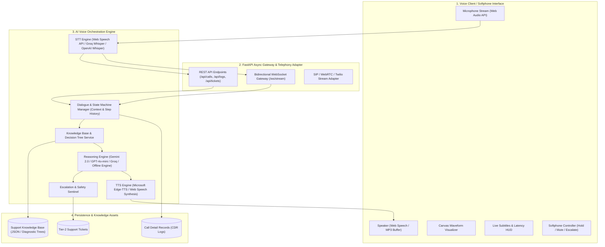
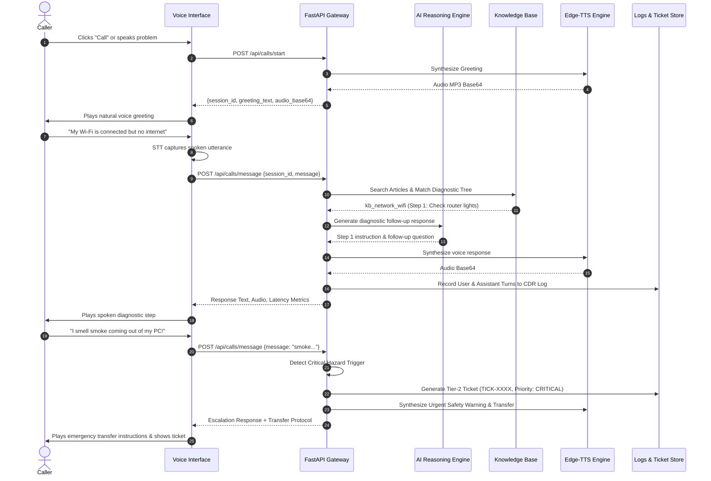

# System Architecture & Technical Specification

## 1. High-Level Architecture Overview

The **ApexCloud AI Voice Technical Support Agent** is designed as a modular, event-driven voice application capable of real-time speech recognition, stateful multi-turn reasoning, knowledge retrieval (RAG), and neural speech synthesis.

---

## 2. Component Breakdown

### 2.1 Voice Interface (Client Layer)
- **Softphone Simulator**: Emulates a real hardware SIP deskphone or mobile support client with interactive call controls (Dial, Mute, Hold, Escalate, Hang Up).
- **Speech-to-Text (STT)**: Employs browser-native continuous Web Speech Recognition (`webkitSpeechRecognition`) for instant zero-latency speech recognition, with fallback to backend Whisper ingestion.
- **Audio Visualizer**: Real-time canvas renderer calculating dynamic sine curves tapered by a Gaussian bell-curve window.

### 2.2 Orchestration & Dialogue State Machine
The core state machine manages the conversation flow through distinct phases:
1. **Greeting & Intake**: Introduces the agent and identifies the core problem domain.
2. **Knowledge Matching & Step Initiation**: Fuzzy and semantic token matching retrieves the matching diagnostic article and loads its step tree.
3. **Step-by-Step Diagnostic Execution**: Presents one diagnostic instruction at a time and asks a focused follow-up question.
4. **Response Evaluation**: Evaluates caller's reply into `positive`, `negative`, or `unclear`.
5. **Resolution Confirmation or Escalation**: On success, confirms resolution; on repeated failures or hazards, generates an Escalation Ticket.

### 2.3 Knowledge Retrieval & RAG
- Structured dataset of categorized technical articles (`Network`, `Account Access`, `Hardware/Printers`, `OS Crashes/BSOD`, `Software Errors`, `Safety Hazards`).
- Each article defines explicit steps with positive indicators, negative indicators, and failure thresholds.

### 2.4 Multi-Provider LLM Engine
- **Built-in Offline Diagnostic Reasoning Engine**: 100% deterministic, rule-based state machine that ensures zero external dependency, high speed, and reliability.
- **API Model Integrations**: Native support for **Google Gemini 2.0 Flash**, **OpenAI GPT-4o-mini**, and **Groq Llama 3.3 70B**.

### 2.5 Text-to-Speech (TTS)
- **Microsoft Edge-TTS Neural Engine**: High-fidelity neural voice synthesis (`en-US-AriaNeural`) streamed as MP3 bytes.
- **Browser Speech Synthesis Fallback**: Instant local playback for offline demonstration.

---

## 3. End-to-End Sequence Diagram

