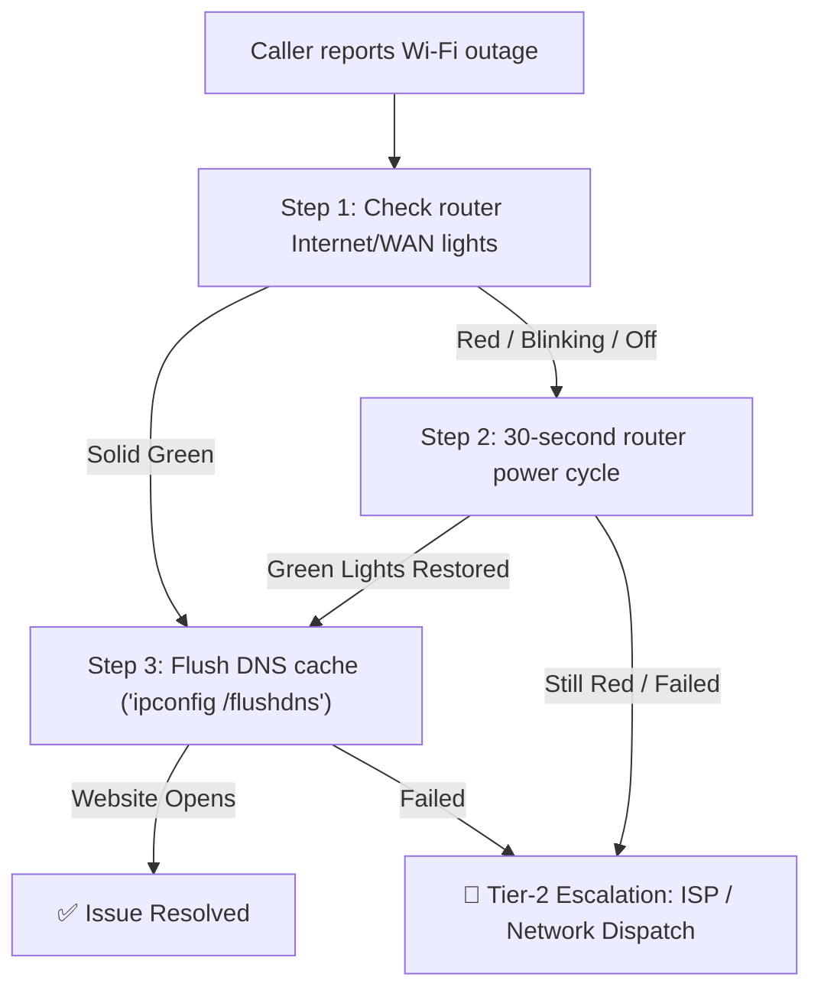
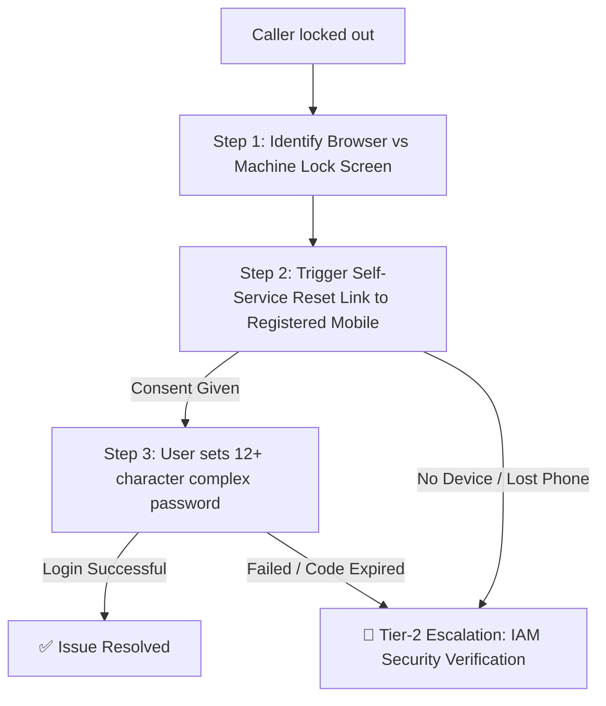
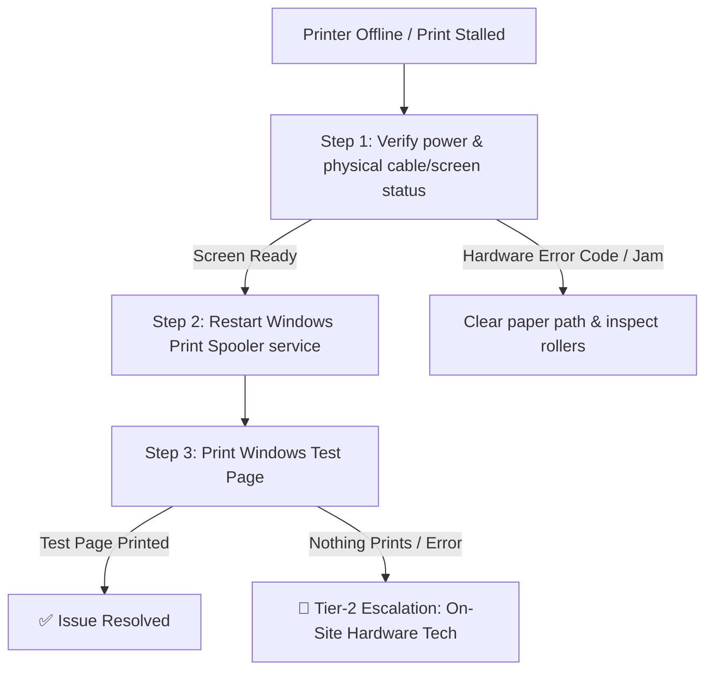
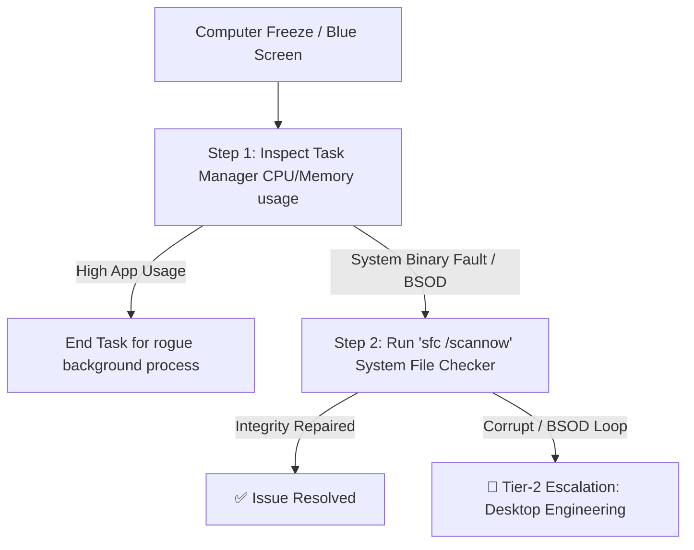
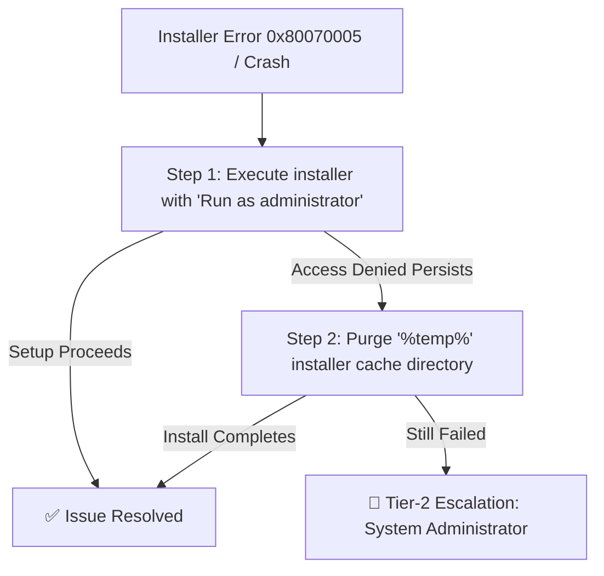
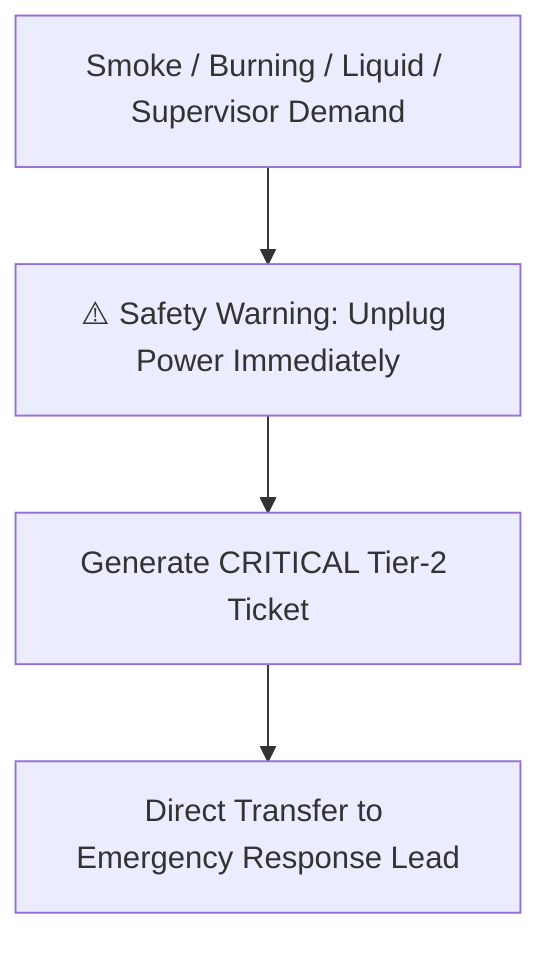

# Technical Support Knowledge Base & Decision Trees

This document outlines the structured troubleshooting decision trees, FAQ datasets, and triage criteria implemented in the AI Voice Agent.

---

## 1. Summary of Support Domains

| Article ID | Category | Common Problem | Steps Count | Escalation Trigger |
|---|---|---|---|---|
| `kb_network_wifi` | Network & Connectivity | Wi-Fi connected but no internet, DNS failure | 3 | Physical fiber cut (LOS red) / 2 failed steps |
| `kb_account_password` | Account & Security | Locked account, forgotten password, 2FA missing | 3 | Lost 2FA phone / Identity verification failure |
| `kb_hardware_printer` | Hardware & Peripherals | Printer offline, stuck queue, paper jam | 3 | Mechanical grinding noise / Roller gear fault |
| `kb_os_bsod_performance` | OS & Performance | High CPU/RAM usage, BSOD crash loop | 2 | BIOS SMART hard drive failure / Unrepairable crash |
| `kb_software_install` | Software & Apps | Install error 0x80070005, Access Denied | 2 | Domain Group Policy restriction / MSI engine failure |
| `kb_critical_escalation` | Critical Escalations | Smoke, burning odor, liquid spill, supervisor | 1 | Immediate safety hazard / Direct customer demand |

---

## 2. Detailed Decision Trees

### 2.1 Wi-Fi & Internet Connectivity (`kb_network_wifi`)

### 2.2 Account Lockout & Password Reset (`kb_account_password`)

### 2.3 Printer & Peripheral Troubleshooting (`kb_hardware_printer`)

### 2.4 OS Performance & BSOD Recovery (`kb_os_bsod_performance`)

### 2.5 Software Installation & Error 0x80070005 (`kb_software_install`)

### 2.6 Critical Hardware Hazards & Supervisor Demands (`kb_critical_escalation`)

---

## 3. General FAQ Dataset

- **Q: What are your technical support hours?**  
  **A:** Our automated AI technical support voice system is available 24 hours a day, 7 days a week. Live human engineering specialists are available 24/7 for critical incidents and 8 AM to 8 PM EST for standard tickets.
- **Q: Can I request a human support specialist at any time?**  
  **A:** Yes, you can request a human specialist at any point during this call by saying "speak with a representative" or clicking the Escalate button on your screen.
- **Q: Where can I track my support ticket status?**  
  **A:** You can view all your active tickets and call history directly in the Support Dashboard tab on this portal.
